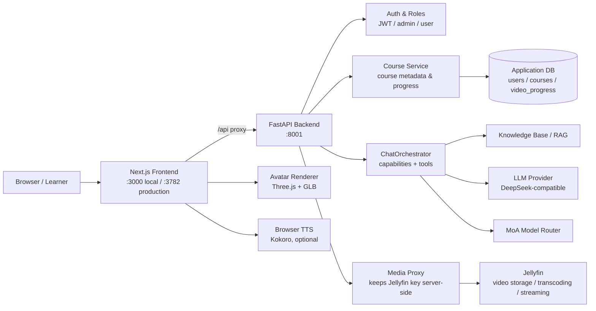
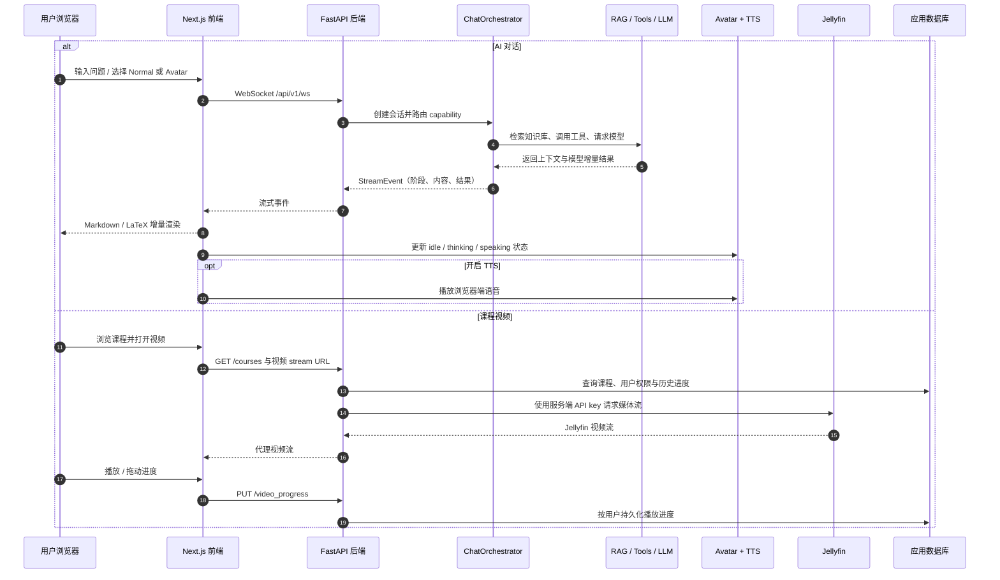

# DeepTutor Plus — 教育视频课程平台

## Mermaid 架构与数据流

### 系统架构



### 数据流转链路



> 在 DeepTutor（个性化智能辅导系统）基础上，近两周完成 **课程点播 + 学习进度** 全链路功能：
> DeepTutor（课程管理/权限/流代理）× Jellyfin（视频存储/转码/并发出流）。

---

## 一、这个项目做了什么

### 近两周核心开发（8/17–8/21）

| 阶段 | 内容 |
|---|---|
| **P1+P2** | DeepTutor × Jellyfin 课程媒体管道：课程/视频管理 API、Jellyfin 流代理（浏览器不接触 API key）、上传/扫描/转码对齐 |
| **P3** | 普通用户课程浏览与播放（`/courses` 列表 + 详情页） |
| **P4** | 认证与角色权限（JWT，admin/user；首个注册用户自动成为 admin） |
| **P5** | 生产编排：docker-compose（DeepTutor + Jellyfin + 可选 PocketBase） |
| **播放器增强** | 键盘快捷键、进度记忆、上一集/下一集、自动连播、倍速（1x–2x）、已看标记、课程进度条、继续上次学习横幅、错误重试、骨架屏、移动端适配 |
| **管理端** | 视频上传（进度条 + 类型/大小校验）、删除确认、封面资源库、上传自动转码 |
| **P2 改进** | 服务端进度持久化（`video_progress` 表 + PUT/GET API，按用户隔离）、前端双写同步（跨设备恢复进度）、课程搜索、界面语言统一中文、暗色模式切换 |

### 原有能力（DeepTutor / OpenTutorAi）

- AI 个性化辅导：答疑、课程、能力工作区
- 3D Avatar 教师（The Scholar / The Mentor / The Coach / The Innovator）
- 浏览器端 TTS（Kokoro）、数学公式渲染（LaTeX）
- 知识库检索（RAG）、MoA 多模型路由

---

## 二、架构

```
浏览器 ──► DeepTutor 前端 (Next.js :3000 本地 / :3782 生产)
             │
             ▼
        DeepTutor 后端 (FastAPI :8001)
          ├─ 课程/视频管理 API
          ├─ 用户认证 (JWT, admin/user)
          └─ 流代理（持 Jellyfin API key，浏览器不接触 key）
             │
             ▼ (容器内网 jellyfin:8096)
        Jellyfin（视频存储/刮削/转码/并发出流）
```

- **DeepTutor** = 课程结构 + 权限 + 流代理（业务层）
- **Jellyfin** = 视频存储 + 转码 + 多人播放（媒体层）
- 两者通过**约定路径 + 扫描 API** 对齐，不共享数据库

---

## 三、本地启动（Windows 开发机）

环境要求：**Python ≥ 3.11**、**Node.js ≥ 20.9**（Next.js 16 硬性要求）、LLM API Key。

```cmd
:: 1. 安装后端依赖（首次约 30–60 分钟，含 torch 等 RAG 依赖）
python -m venv .venv
.venv\Scripts\python.exe -m pip install -e ".[server]"

:: 2. 安装前端依赖
cd web
npm install --legacy-peer-deps
cd ..

:: 3. 配置环境变量
copy .env.example .env
::    编辑 .env，至少填写 LLM_API_KEY / LLM_MODEL（如 DeepSeek）

:: 4. 启动后端（新窗口）
start-backend-local.cmd

:: 5. 启动前端（新窗口）
start-frontend-local.cmd
```

访问：

| 入口 | 地址 |
|---|---|
| 课程点播 | http://localhost:3000/courses |
| 管理后台 | http://localhost:3000/admin/courses（admin 创建课程/上传视频） |
| 后端文档 | http://localhost:8001/docs |

> 认证默认关闭（`AUTH_ENABLED=false`）即可先跑通；多人内测时设 `AUTH_ENABLED=true`，首个注册用户自动成为 admin。
> 局域网多人访问：前端 dev 加 `-H 0.0.0.0`，并放行 3000/8001 端口。

### Jellyfin（可选，视频点播需要）

本地 `docker start jellyfin`（媒体目录 `D:\Media` 映射到容器 `/media`），
管理后台新建"课程库"：类型 **TV Shows**、路径 `/media/Courses`、关闭联网刮削。

---

## 四、生产部署（Linux + Docker + Jellyfin）

```bash
cp .env.example .env   # 填写 LLM / AUTH_ENABLED=true / JELLYFIN_* / CORS_ORIGIN
docker compose -f docker-compose.yml -f docker-compose.media.yml up -d --build
```

- 生产端口：前端 **3782**、后端 **8001**、Jellyfin **8096**
- **远程部署 + 认证开启时**必须在 `.env` 设置 `CORS_ORIGIN=http://<服务器公网IP>:3782`，
  否则浏览器请求被 CORS 拦截导致登录/API 失效（详见 `DEPLOY.md` / `docs/DEPLOY-MEDIA.md`）

---

## 五、测试与验证

```cmd
:: 后端进度持久化回归测试
.venv\Scripts\python.exe tests\test_course_progress.py

:: 前端 node 单测（96 个）
cd web && node scripts\run-node-tests.mjs

:: 前端生产构建
cd web && node --max-old-space-size=4096 node_modules\next\dist\bin\next build --webpack
```

---

## 六、安全规范

- **禁止在源码中硬编码密钥**（API key/token/secret），一律环境变量读取。
- 仓库已配置 **pre-commit 密钥扫描钩子**（安装：`bash scripts/install-pre-commit.sh`），
  含密钥的提交会被拦截；手动扫描：`bash scripts/secret-scan.sh --all`。
- 事故复盘与完整规范见 **`SECURITY.md`**。

---

## 七、相关文档

- `SECURITY.md` — 密钥管理规范与事故复盘
- `docs/DEPLOY-MEDIA.md` — 媒体/生产部署细节
- `docs/TROUBLESHOOTING.md` — 常见问题排查
- `MENTOR_HANDOFF.md` — 原项目交接说明
